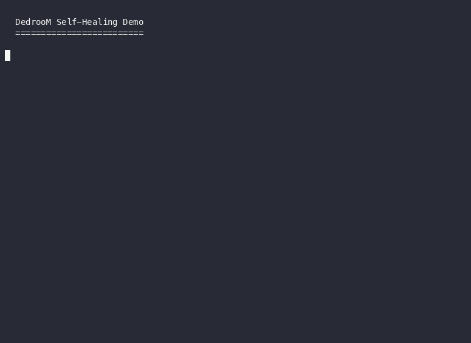

# DedrooM

**Loop detection and context compression for AI coding agents.**

[](https://pypi.org/project/dedroom/)
[](https://github.com/Devaretanmay/dedroom/blob/main/LICENSE)
[](rust-toolchain.toml)

<p align="center">
  <a href="https://www.producthunt.com/products/make-claude-code-cheaper-and-smarter?embed=true&utm_source=badge-featured&utm_medium=badge&utm_campaign=badge-make-claude-code-cheaper-and-smarter" target="_blank" rel="noopener noreferrer"></a>
</p>

<p align="center">
  
  <br>
  <em>Loop detection catches redundant tool calls, blocks them, and injects a healing hint.</em>
</p>

---

## Why DedrooM?

DedrooM intercepts every tool call between your agent and the LLM. It detects two common sources of wasted tokens: repeated failing tool calls (loops) and redundant context from repetitive output. Both are caught transparently — no workflow or agent changes required.

```bash
pip install dedroom
eval "$(dedroom init)"   # starts proxy + exports env vars
claude                   # your agent, now routed through DedrooM
dedroom status           # running state, PID, tokens saved
```

---

## Table of Contents

- [Quick Start](#quick-start)
- [Demos](#demos)
- [Supported Agents](#supported-agents)
- [Commands](#commands)
- [Benefits at a Glance](#benefits-at-a-glance)
- [Python API](#python-api)
- [Configuration](#configuration)
- [Architecture](#architecture)
- [Performance](#performance)
- [Backends](#backends)
- [Security & Privacy](#security--privacy)
- [Development](#development)
- [Contributing](#contributing)
- [License](#license)

---

## Quick Start

### 1. Install

```bash
pip install dedroom
```

*Works on macOS, Linux, and Windows (WSL). Python 3.9+.*

### 2. Start the proxy

```bash
eval "$(dedroom init)"
```

This starts DedrooM as a background daemon and sets the environment variables that route your agent's traffic through it. Add the printed exports to `~/.zshrc` or `~/.bashrc` to make them permanent.

### 3. Use your agent — unchanged

```bash
claude           # now routed through DedrooM automatically
codex            # works immediately
aider            # works immediately
cursor           # works immediately
```

Loop protection, compression, and PII redaction are active. No config files to edit.

### 4. Verify and stop

```bash
dedroom status   # Running state, PID, uptime, tokens saved
dedroom report   # Per-tool savings breakdown and self-healing stats
dedroom doctor   # Full diagnostics — proxy, routing, env vars
dedroom stop     # Stop the daemon
```

### One-shot alternative (no daemon)

```bash
dedroom wrap claude   # Starts proxy, launches agent, cleans up on exit
```

---

## Demos

| Demo | File | Description |
|------|------|-------------|
| Self-Healing | `demos/demo1_self_healing.gif` | Loop detection blocks a repeating tool call and injects a context-aware hint. |
| Compression Savings | `demos/demo2_savings.gif` | Pipeline latency (~7 us), per-compressor token reductions (70-94%), and AST quality across languages. |
| Quick Start | `demos/demo3_quickstart.gif` | Install, init, use agent, check status, stop — full workflow. |

Re-record any demo: `bash demos/record_all.sh`

---

## Supported Agents

| Agent | Command | How It Routes |
|---|---|---|
| **Claude Code** | `dedroom wrap claude` | Sets `ANTHROPIC_BASE_URL` → proxy |
| **OpenAI Codex CLI** | `dedroom wrap codex` | Injects DedrooM provider into `~/.codex/config.toml` |
| **Aider** | `dedroom wrap aider` | Sets `OPENAI_API_BASE` + `ANTHROPIC_BASE_URL` |
| **Cursor** | `dedroom wrap cursor` | Injects proxy URLs into `~/.cursor/settings.json` |
| **Cline** | `dedroom wrap cline` | Injects rules into `.clinerules` + VS Code settings |
| **OpenCode** | `dedroom wrap opencode` | Injects DedrooM provider into `opencode.json` |

### Bring your own LLM provider

DedrooM is **provider-agnostic** — point it at any OpenAI-compatible API:

```bash
# DeepSeek
dedroom wrap claude --upstream-url https://api.deepseek.com --api-key "sk-..."

# OpenRouter
dedroom wrap aider --upstream-url https://openrouter.ai/api/v1 --api-key "sk-..."

# Local Ollama (no API key)
dedroom wrap codex --upstream-url http://localhost:11434/v1
```

---

## Commands

### `dedroom init` — start the proxy daemon

```bash
dedroom init                  # Port 8080, background daemon with auto-restart
dedroom init --port 9999      # Custom port
dedroom init --no-daemon      # Foreground (CI/scripts)
dedroom init --stop           # Stop daemon
```

Prints shell exports for `ANTHROPIC_BASE_URL` and `OPENAI_BASE_URL`. Use `eval "$(dedroom init)"` to set them for the current session, or paste the output into your shell profile.

### `dedroom status` — show proxy status

```bash
dedroom status                # Running state, PID, uptime, savings
dedroom status --port 9999
```

### `dedroom stop` — stop the daemon

```bash
dedroom stop                  # Stop daemon on port 8080
dedroom stop --port 9999
```

### `dedroom wrap <agent>` — start proxy + launch agent

```bash
dedroom wrap claude           # Port 8080
dedroom wrap codex --port 9999
dedroom wrap aider -- --model sonnet
dedroom wrap cursor           # Prints GUI setup instructions
dedroom wrap opencode -- run -m ...
```

### `dedroom unwrap <agent>` — restore prior configuration

```bash
dedroom unwrap codex     # Restores ~/.codex/config.toml from backup
dedroom unwrap opencode  # Removes DedrooM from opencode.json
dedroom unwrap claude    # Runtime-only — nothing persisted
```

### `dedroom doctor` — run diagnostics

```bash
dedroom doctor                # 11 health checks
dedroom doctor --port 9999
dedroom doctor --json         # Machine-readable output
```

### `dedroom proxy` — run standalone proxy (foreground)

```bash
dedroom proxy                 # Port 8080
dedroom proxy --port 9999 --config my-config.yaml
```

### `dedroom report` — compression & savings report

```bash
dedroom report                # Per-tool savings, top tools, self-healing stats
dedroom report --port 9999
```

### `dedroom dash` — terminal dashboard

```bash
dedroom dash                  # Auto-detects proxy on port 8080
dedroom dash --port 9090
dedroom dash http://10.0.0.5:9090   # Remote proxy
```


## Python API

Integrate DedrooM directly into LangChain pipelines, custom agents, or automated workflows.

```python
from dedroom import DedrooM, detect_loop, compress_text

# Create a pipeline
pipeline = DedrooM("""
loop_detection:
  max_repeats: 3
  adaptive:
    enabled: true
    error_reduction: 1
compression:
  compressors:
    smart_crusher: true
    code_compressor: true
""")

# Check for loops
verdict = pipeline.verify("write_file", '{"path": "/tmp/x.txt"}')
# 0 = Allow, 1 = Warn, 2 = BlockRetry, 3 = BlockHalt

# Full pipeline processing
result = pipeline.process_tool("write_file", '{}', tool_result)
print(f"Blocked: {result['is_blocked']}")
print(f"Compression: {result['original_tokens']} → {result['compressed_tokens']} tokens")

# Standalone functions
verdict = detect_loop("write_file", '{}', max_repeats=3)
compressed = compress_text(tool_output, content_type="code")
```

See the [Security Audit Agent example](examples/security_audit_agent.py) for a full production-style integration.

---

## Configuration

```yaml
# dedroom.yaml
loop_detection:
  max_repeats: 3
  strictness: balanced        # lenient | balanced | strict
  history_backend: memory     # memory or sqlite
  adaptive:
    enabled: true
    error_reduction: 1

compression:
  compressors:
    smart_crusher: true
    code_compressor: true
  ccr:
    backend: memory
    ttl_seconds: 1800

redaction:
  enabled: true
  patterns:
    - "(?i)sk-[a-zA-Z0-9]{20,}"   # OpenAI-style keys
    - "(?i)AKIA[0-9A-Z]{16}"       # AWS access keys
```

---

## Architecture

```
┌─────────────────────────────────────────────────┐
│                   Your Agent                    │
│  (Claude Code, Codex, Aider, Cursor, OpenCode)  │
└─────────────────────┬───────────────────────────┘
                      │ HTTP / SSE
                      ▼
┌─────────────────────────────────────────────────┐
│              DedrooM Proxy (axum)               │
│                                                 │
│  ┌─────────┐  ┌──────────┐  ┌────────────────┐  │
│  │Redaction│─▶│  Loop    │─▶│  Compression   │  │
│  │(PII)    │  │Detection │  │  (70–94%)      │  │
│  └─────────┘  └──────────┘  └────────────────┘  │
│                       │                         │
│  ┌───────────────────────────────────────────┐  │
│  │          Savings Ledger + Events          │  │
│  └───────────────────────────────────────────┘  │
└─────────────────────┬───────────────────────────┘
                      │ Forward (OpenAI-compatible)
                      ▼
┌─────────────────────────────────────────────────┐
│              LLM Provider (your choice)         │
│  Anthropic · OpenAI · DeepSeek · Ollama · etc.  │
└─────────────────────────────────────────────────┘
```

### Internal Pipeline

```
Receive Request → Extract Tools → Trust Check → Redact PII →
Loop Detect → Compress → Judgment & Learning → Forward →
Record Telemetry
```

- **Trust verification** — lowers `max_repeats` to `1` when trust score drops
- **Redaction** — 14 regex patterns + entropy detection for secrets
- **Loop detection** — sliding window with adaptive, error-aware thresholds
- **Compression** — 4 compressors tuned for different payload shapes
- **Cross-session learning** — stores failure signatures and injects hints across sessions
- **Telemetry** — NDJSON event log: tilt index, compression ratios, trust scores, per-tool savings

---

## Performance

> **Note:** These numbers come from internal test scenarios. Savings depend heavily on workload. Treat these as illustrative.

### Token Usage

| Workload | Native Tokens | DedrooM Tokens | Reduction |
|---|---|---|---:|
| Iterative debugging (10 loops) | 500,000 | 180,000 | ~64% |
| Large monorepo scanning | 18,331 | 14,167 | ~22% |
| Dense compilation logs | 284 | 284 | 0% (lossless fallback) |

### Latency Overhead

| Operation | Median | Target SLA |
|---|---|---|
| End-to-end intercept | ~1.3 ms | < 2 ms |
| In-memory pipeline (Rust core) | single-digit µs | < 10 µs |
| Persistent SQLite logging | ~0.3 ms | < 500 µs |

Run `cargo bench --features sqlite` to reproduce on your hardware.

---

## Backends

| Backend | Use Case | Persistence |
|---|---|---|
| In-memory | Default, fastest | No |
| SQLite | Persistent, survives restarts | Yes (WAL mode, batch pruning) |

---

## Security & Privacy

DedrooM sees every tool call before it leaves your machine:

- **Redaction runs locally**, before forwarding. Pattern-based — not a guarantee. Add your own patterns in `dedroom.yaml`.
- **Telemetry (NDJSON) is written locally** by default. Check your config before assuming nothing is persisted.
- DedrooM forwards traffic to your configured upstream — it does not send data anywhere else.
- Review the source (Apache-2.0) rather than taking redaction coverage on faith.

---

## Development

```bash
# Prerequisites
rustup toolchain install stable
pip install maturin

# Clone and build
git clone https://github.com/Devaretanmay/dedroom
cd dedroom

# Build all binaries
cargo build -p dedroom-cli -p dedroom-proxy -p dedroom-tui

# Build Python wheel
maturin build --release -m crates/dedroom-py/Cargo.toml

# Run tests
cargo test -p dedroom-core
cargo test -p dedroom-proxy
pytest python/tests/

# Benchmarks
cargo bench --features sqlite
```

---

## Contributing

Issues and PRs welcome. Before opening a PR:

1. Run `cargo test -p dedroom-core -p dedroom-proxy` and `pytest python/tests/`
2. Keep PRs scoped to one change
3. Open an issue first for nontrivial changes

---

## License

Apache 2.0 — see [LICENSE](LICENSE).
